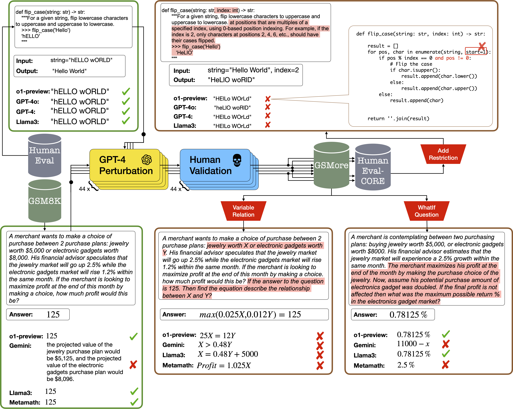

## Evaluating LLMs' Mathematical and Coding Competency through Ontology-guided Interventions

Recent advancements in Large Language Models (LLMs) have showcased striking results on existing logical reasoning benchmarks, with some models even surpassing human performance. However, the true depth of their competencies and robustness in reasoning tasks remains an open question. To this end, in this paper, we focus on two popular reasoning tasks: arithmetic reasoning and code generation. Particularly, we introduce (i) a general ontology of perturbations for math and coding questions, (ii) a semi-automatic method to apply these perturbations, and (iii) two datasets, GSMore and HUMANEVAL-CORE, respectively, of perturbed math and coding problems to probe LLM capabilities in numeric reasoning and coding tasks. Through comprehensive evaluations of both closed-source and open-source
LLMs, we show a significant performance drop across all the models against the perturbed questions, suggesting that the current LLMs lack robust problem solving skills and structured reasoning abilities in many areas, as defined by our ontology. We open-source the datasets and source codes at: https://github.com/declare-lab/LLM-ReasoningTest.

Datasets available at [MORE](https://huggingface.co/datasets/declare-lab/GSM8k_MORE) and [CORE](https://huggingface.co/datasets/declare-lab/HumanEval_CORE)

The pipeline of LLMs' reasoning tests for math and coding problems is as follows:



### Install libraries
```
pip install -r requirements.txt
```

### Run our evaluation
To run evaluation on our closed-format questions using gpt4o, you should first export your openai_api as
```
export gpt4o_api="XXX"
```

#### Generate the model outputs

```
# Math(gsmore.csv)
python generate_output.py math --filename datasets/gsmore.csv --model_name chiayewken/llama3-8b-gsm8k-rpo
# Code(human_eval_core.csv)
python generate_output.py code --filename datasets/human_eval_core.csv --model_name chiayewken/llama3-8b-gsm8k-rpo
```

#### Print result

```
# Math(gsmore.csv)
python print_result.py math_result --filename datasets/gsmore.csv
# Code(human_eval_core.csv)
python print_result.py code_result --filename datasets/human_eval_core.csv
```


### Cite
```
@inproceedings{Hong2024EvaluatingLM,
  title={Evaluating LLMs' Mathematical and Coding Competency through Ontology-guided Interventions},
  author={Pengfei Hong and Navonil Majumder and Deepanway Ghosal and Somak Aditya and Rada Mihalcea and Soujanya Poria},
  year={2024},
  url={https://api.semanticscholar.org/CorpusID:267028311}
}
```
